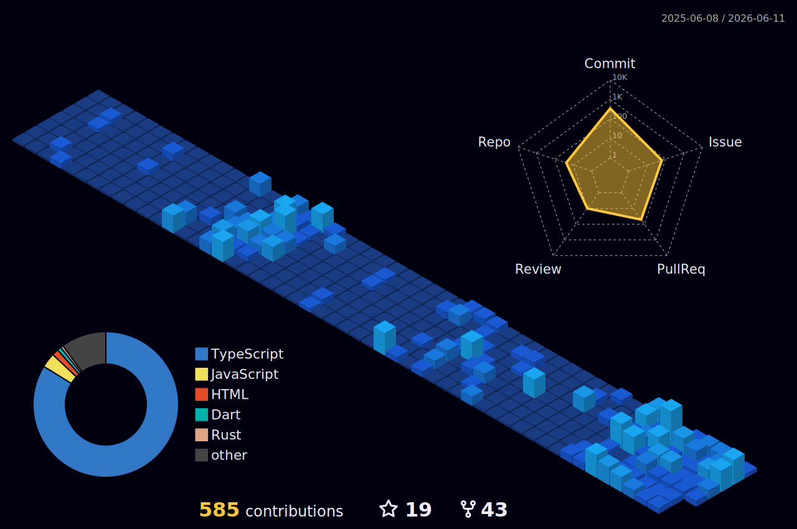
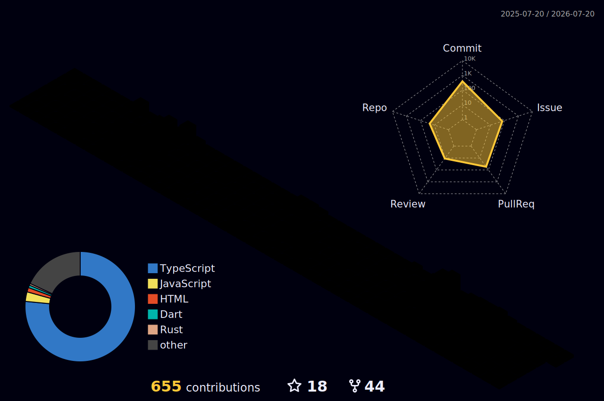

# <picture></picture> Kanav Modi

 

  

- 💼 Working as **Software Developer Intern** at [AdeptStation](https://adeptstation.com/)

- 🏆 **Secretary** at Code Vimarsh

- 🌱 I’m currently learning **Data Structures & Algorithms**

- 🤝 Open to collaborating on **Full Stack & AI Projects**

<h3 align="center">💻 Programming Languages</h3>

  
  
  
  
  

<h3 align="center">🌐 Frameworks & Web Technologies</h3>

  
  
  
  
  
  

<h3 align="center">🤖 AI & Machine Learning</h3>

  
  

<h3 align="center">🗄️ Databases</h3>

  
  
  
  
  

<h3 align="center">🛠️ Tools, Cloud & OS</h3>

  
  
  
  
  
  

<!-- <h3 align="center">📊 GitHub Stats</h3>

  
  

  

 -->

<h3 align="center">📈 Contribution Activity</h3>

  <!--  -->
  

<h3 align="center">🌐 3D Contribution Graph</h3>

  <!--  -->
  

<h3 align="center">🎖️ Holopin Badges (Hacktoberfest + Open Source)</h3>

  <a href="https://holopin.io/@kanavcode">
    
  </a>

